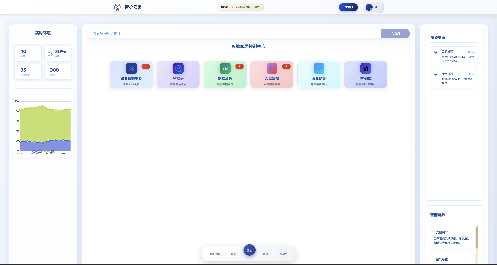
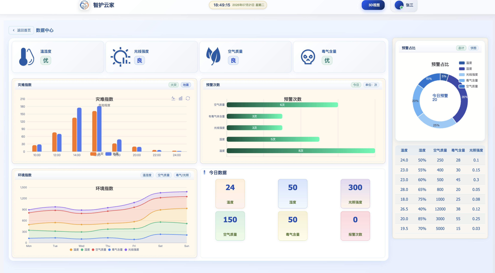
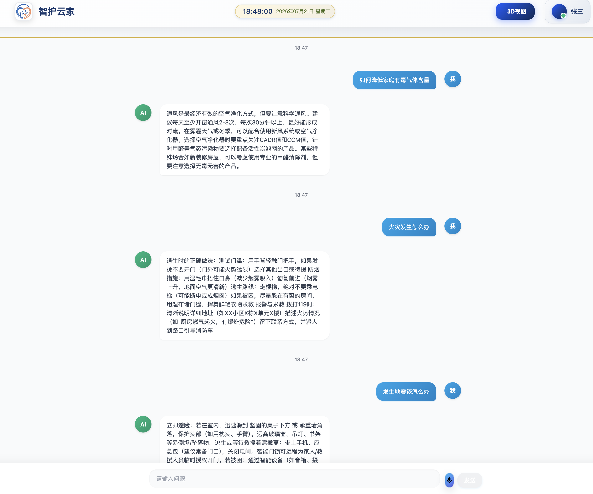
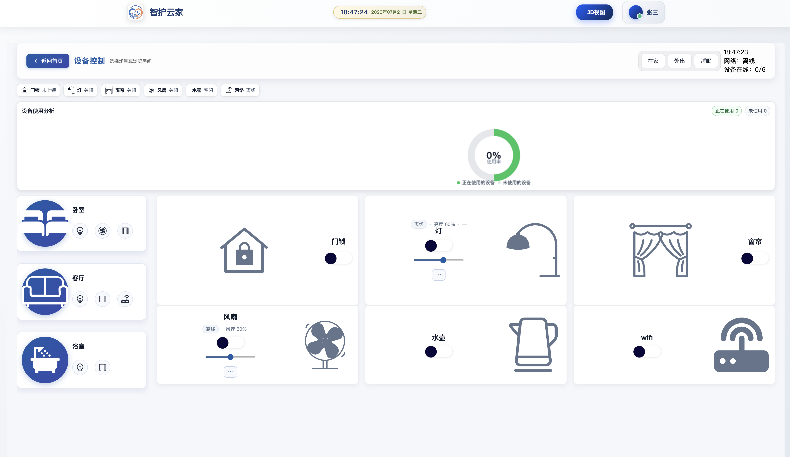
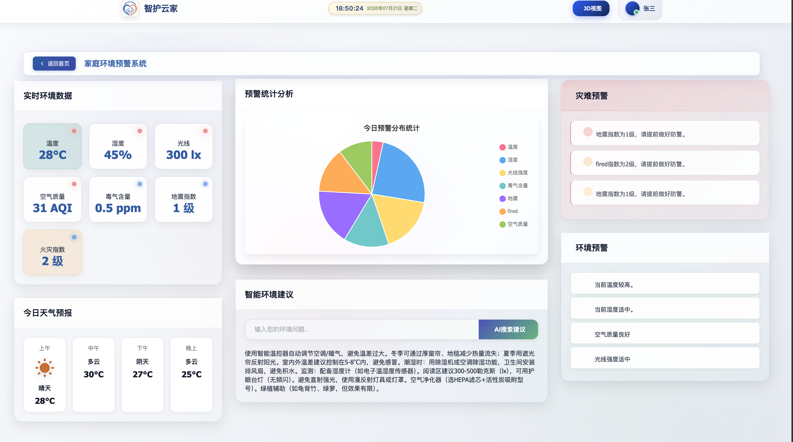
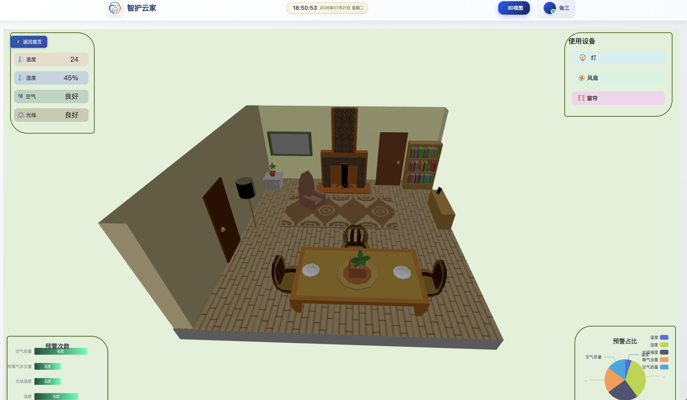

# 🏠 智护云家 (SmartGuard Cloud AIoT)

> 智能养老 · 贴心守护 — 基于 Spring Boot + Vue 3 的智能家居 AIoT 综合管理平台

[](https://www.oracle.com/java/)
[](https://spring.io/projects/spring-boot)
[](https://vuejs.org/)
[](LICENSE)

---

## 📖 项目简介

智护云家是一个面向智慧养老场景的智能家居 AIoT 综合管理平台。系统集成了**物联网设备控制、环境数据监测、AI 智能对话、语音交互、实时告警、3D 可视化**等核心功能，旨在通过科技手段提升居家养老的安全性与便捷性。

### 🎯 核心亮点

- **🛋️ 全屋智能控制** — 灯光、窗帘、风扇、门锁等设备统一管理，支持场景一键切换（在家/外出/睡眠）
- **📊 环境数据监控** — 温度、湿度、光照、空气质量、有毒气体等环境指标实时采集与可视化
- **🤖 AI 智能助手** — 集成 DeepSeek / Coze 大模型，支持文字+语音双模式对话
- **🚨 智能告警** — 火灾、地震、摔倒检测，异常事件实时推送
- **🏗️ 3D 数字孪生** — Three.js 驱动的房屋 3D 模型，直观展示设备状态
- **🎙️ 语音交互** — 基于讯飞星火 / Coze 的 ASR 语音识别与 TTS 语音合成

---

## 🖼️ 系统界面

| 首页仪表盘 | 数据中心 |
|:---:|:---:|
|  |  |

| AI 助手 | 设备控制 |
|:---:|:---:|
|  |  |

| 消息预警 | 3D 视图 |
|:---:|:---:|
|  |  |

---

## 🏗️ 系统架构

```
┌──────────────────────────────────────────────────────────┐
│                    前端展示层 (Vue 3)                      │
│  Element Plus │ Vant UI │ ECharts │ Three.js │ Tailwind  │
└──────────────────────────┬───────────────────────────────┘
                           │ HTTP / WebSocket
┌──────────────────────────▼───────────────────────────────┐
│                  后端服务层 (Spring Boot 3.4)              │
│  用户管理 │ 设备控制 │ 环境监测 │ AI对话 │ 告警系统       │
└───────┬──────────┬──────────┬──────────┬─────────────────┘
        │          │          │          │
   ┌────▼───┐ ┌───▼────┐ ┌───▼────┐ ┌───▼────┐
   │  MySQL │ │  Redis │ │MongoDB │ │InfluxDB│
   │(业务数据)│ │(缓存)  │ │(AI记录) │ │(时序数据)│
   └────────┘ └────────┘ └────────┘ └────────┘
        │
   ┌────▼────────────┐  ┌──────────────────┐
   │  MQTT Broker    │  │   第三方 AI 服务   │
   │ (IoT设备通信)    │  │ DeepSeek / Coze   │
   └─────────────────┘  └──────────────────┘
```

---

## 🛠️ 技术栈

### 后端 (CloudHome-project)

| 类别 | 技术 |
|------|------|
| 核心框架 | Spring Boot 3.4.3, Java 17, Maven |
| 数据库 | MySQL 8.0, Redis 6.0, MongoDB 4.4, InfluxDB 2.x |
| 消息通信 | MQTT 3.1.1, WebSocket (STOMP) |
| AI 引擎 | Spring AI 1.0.1, DeepSeek API, Coze Bot |
| 语音服务 | 讯飞星火 ASR/TTS, Coze TTS |
| 安全认证 | JWT 0.12.6, Spring Security |
| ORM | MyBatis-Plus 3.5.7 |
| 工具库 | Lombok, Hutool 5.8.24, BCrypt |
| 第三方 | 高德天气 API, 阿里云 OSS, 讯飞星火 |

### 前端 (hometools)

| 类别 | 技术 |
|------|------|
| 框架 | Vue 3, Vue Router, Pinia |
| UI 组件库 | Element Plus, Vant UI |
| 可视化 | ECharts, vue-echarts, Three.js |
| 样式 | Tailwind CSS, Scoped CSS |
| 构建 | Vue CLI 5, Webpack |
| 通信 | Axios, SockJS, STOMP.js |

---

## 📁 项目结构

```
SmartGuard-Cloud-AIoT/
├── CloudHome-project/            # Spring Boot 后端
│   ├── src/main/java/com/chome/
│   │   ├── config/               # 配置类 (MQTT/WebSocket/InfluxDB/OSS...)
│   │   ├── controller/           # REST API 控制器
│   │   ├── service/              # 业务逻辑层
│   │   │   ├── impl/             # 实现类
│   │   │   └── impl/voice/       # 语音处理 (ASR/TTS)
│   │   ├── domain/               # 领域模型
│   │   │   ├── entity/           # 数据库实体
│   │   │   ├── dto/              # 数据传输对象
│   │   │   ├── vo/               # 视图对象
│   │   │   └── config/           # 配置属性
│   │   ├── mapper/               # MyBatis 映射器
│   │   ├── handler/              # WebSocket 处理器
│   │   ├── interceptor/          # JWT 拦截器
│   │   ├── utils/                # 工具类
│   │   ├── constants/            # 常量定义
│   │   └── factory/              # 工厂类
│   └── src/main/resources/
│       ├── application.yml       # 应用配置
│       └── mapper/               # MyBatis XML
│
├── hometools/                    # Vue 3 前端
│   ├── src/
│   │   ├── views/                # 页面视图
│   │   │   ├── main/             # 主页面
│   │   │   │   ├── First/        # 首页仪表盘
│   │   │   │   ├── Control/      # 设备控制
│   │   │   │   ├── DataShow_cultural.vue  # 数据监控
│   │   │   │   ├── Warn/         # 消息预警
│   │   │   │   └── 3D/           # 3D 视图
│   │   │   ├── AI/               # AI 对话
│   │   │   ├── login/            # 登录注册
│   │   │   └── video/            # 视频监控
│   │   ├── components/           # 通用组件
│   │   ├── router/               # 路由配置
│   │   ├── store/                # Pinia 状态管理
│   │   ├── utils/                # 工具函数
│   │   ├── api/                  # API 封装
│   │   └── plugins/              # 插件
│   └── public/
│       └── models/               # 3D 模型资源
│
└── 界面截图/                     # 系统截图
```

---

## 🚀 快速开始

### 前置要求

| 软件 | 版本 | 说明 |
|------|------|------|
| JDK | 17+ | 后端运行环境 |
| Maven | 3.8+ | 后端构建工具 |
| Node.js | 16+ | 前端运行环境 |
| MySQL | 8.0+ | 关系型数据库 |
| Redis | 6.0+ | 缓存服务 |
| InfluxDB | 2.x | 时序数据库（可选） |
| MongoDB | 4.4+ | 文档数据库（可选） |
| MQTT Broker | 3.1.1 | IoT 通信（可选） |

### 1️⃣ 克隆项目

```bash
git clone https://github.com/FENG-lxj/SmartGuard-Cloud-AIoT.git
cd SmartGuard-Cloud-AIoT
```

### 2️⃣ 启动后端

```bash
cd CloudHome-project

# 创建数据库
mysql -u root -p -e "CREATE DATABASE IF NOT EXISTS \`WiseGuardCloudHome-Project\` CHARACTER SET utf8mb4 COLLATE utf8mb4_unicode_ci;"

# 编译运行
mvn clean package -DskipTests
java -jar target/CloudHome-project-0.1.0.jar
```

后端默认运行在 `http://localhost:8023`

### 3️⃣ 启动前端

```bash
cd hometools

# 安装依赖
npm install

# 开发模式启动
npm run serve
```

前端默认运行在 `http://localhost:8080`

### 4️⃣ 访问系统

打开浏览器访问 `http://localhost:8080`，默认账号：`admin` / `admin`

---

## ⚙️ 配置说明

### 后端核心配置 (`application.yml`)

```yaml
server:
  port: 8023

spring:
  datasource:
    url: jdbc:mysql://localhost:3306/WiseGuardCloudHome-Project
    username: root
    password: your_password
  data:
    redis:
      host: localhost
      port: 6379
    mongodb:
      uri: mongodb://localhost:27017/CHome_chat_memory
  influx:
    url: http://localhost:8086
    token: your_influx_token
    org: CHome
    bucket: CHome_Environment

# AI 服务（按需配置）
spring.ai.openai:
  api-key: your_deepseek_api_key
  base-url: https://api.deepseek.com
```

### 前端 API 地址

前端 API 地址在 `hometools/src/utils/request.js` 中配置：

```js
const instance = axios.create({
  baseURL: 'http://localhost:8023',
  timeout: 10000
})
```

---

## 🧩 主要功能模块

| 模块 | 路径 | 功能说明 |
|------|------|----------|
| 🏠 首页仪表盘 | `/first` | 环境数据总览、天气信息、快捷导航 |
| 📊 数据中心 | `/dataShow` | 环境趋势图表、灾难预警、历史数据 |
| 🎮 设备控制 | `/control` | 全屋设备开关、场景联动、设备统计 |
| 🤖 AI 助手 | `/ai` | 大模型对话、语音房间、历史记录 |
| 🚨 消息预警 | `/warn` | 异常告警列表、报警消息推送 |
| 🏗️ 3D 视图 | `/3D` | 房屋数字孪生、设备状态可视化 |
| 📹 视频监控 | `/monitor` | 实时摄像头画面查看 |

---

## 📄 License

本项目基于 MIT 协议开源。

---

## 🙏 致谢

- [Spring Boot](https://spring.io/projects/spring-boot)
- [Vue.js](https://vuejs.org/)
- [Element Plus](https://element-plus.org/)
- [ECharts](https://echarts.apache.org/)
- [Three.js](https://threejs.org/)
- [DeepSeek](https://www.deepseek.com/)
- [讯飞星火](https://xinghuo.xfyun.cn/)
- [高德开放平台](https://lbs.amap.com/)


